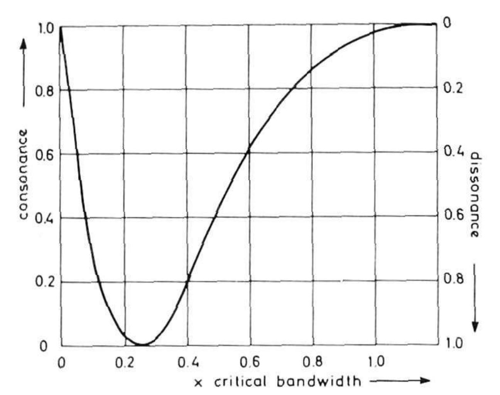
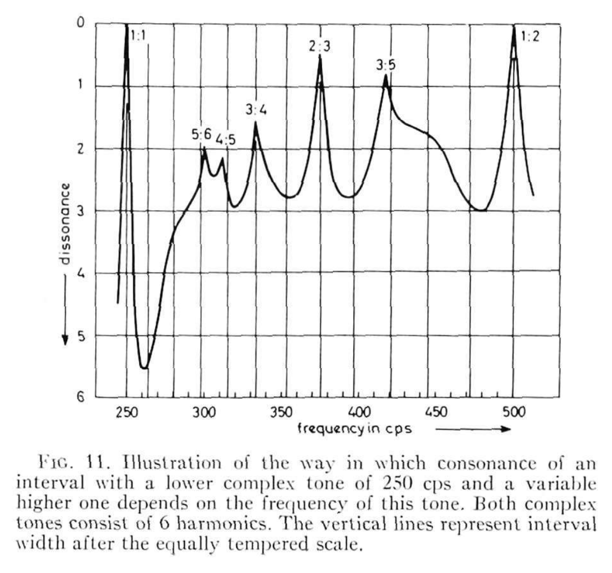

# Consonance and Dissonance

A discussion of Plomp, R., and W. J. M. Levelt. “[Tonal Consonance and Critical Bandwidth.](https://doi.org/10.1121/1.1909741)” The Journal of the Acoustical Society of America 38, no. 4 (October 1, 1965): 548–60. and some related works.

## What makes a sound sound good?

And not just any sound. A musical sound. A _tone_. What makes two tones sound good together? Or bad? Why are some tones _consonant_ and some others _dissonant_?

This may sound like a purely theoretical question, but I was in the middle of building a music synthesizer from scratch and digging into the depths of music theory. Traditional musical instruments have been designed so that they can produce both consonant and dissonant tones, and my synthesizer _could_ follow the pattern of most Western musical instruments by using the equal-tempered scale. But then... that would mean missing an opportunity dig even deeper!

So while I could easily just look up the frequencies of tones as played by a piano, I started reading about the equal-tempered scale and the physiological basis for consonance and dissonance. What follows is a brief account of my explorations.

## Some background (music)

The _pitch_ of a tone (that is, the quality of the tone that we perceive as high or low) is determined by its frequency. Some tones with different pitches sound good when played together and some don't sound good. Composers want to leverage both tones that sound good together as well as those that that don't, for example, by using dissonant tones to create tension and consonant tones to resolve it.

One case that's generally considered to be consonant is when the frequency of one tone is twice the frequency of another: that is, when the ratio between their frequencies is 2:1. In this case, these tones are separated by an octave, and we use the same name for both pitches in the Western scale (for example, we call them both "A"). The frequency of A3 (or A in the third octave) is 220 Hz, and the frequency of A4 (or the A in the forth octave) is 440 Hz. <!-- Here's what those two tones sound like: -->

<!--```tuunel
    C[$220 $440]^1
```-->
<!-- cargo run C 220 440 -->

<!-- The frequency of A5 (or the A in the fifth octave) is 880 Hz, and... well, you get the idea.  -->

### Log-er-rhythm

Pitch is related to frequency _logarithmically_. As we increase the pitch, the frequency goes up too but, well, _more_. For example, B3 is one step above A3, and B4 is one step above A4. We give them the same names (A and B), and we perceive the _difference between the pitches_ of A3 and B3 to be the *same* as the difference between that of A4 and B4. However, the _difference between the frequencies_ of A4 and B4 is *twice* that between A3 and B3.

|                | Pitch | Frequency (Hz) | Pitch | Frequency (Hz) | 
| -------------- | ----- | -------------: | ----- | -------------: |
|                | A3    | 220.0          | A4    | 440.0          |
|                | B3    | 246.9          | B4    | 493.9          |
| **Difference** | one step | 26.9        | one step | 53.9        |

<!--
Here, listen for yourself:

```tuunel
    [$220 $246.9 $440 $493.9]^1
```
-->
<!-- cargo run S 220 247 440 -->

Pitch is one of several perceptual scales: these are scales that describe how we (humans) react to the world around us, whether that's the brightness or color of light, the temperature or humidity of air, or the loudness of a sound. People have studied how we react to these aspects of our environment through a wonderful mix of physiology, psychology, and physics, and these studies have a wide range of applications from art to engineering.


## Dissonant theories

I stumbled upon Miller Puckette's wonderful course notes "[Acoustics for Musicians and Artists](https://msp.ucsd.edu/syllabi/170.21f/index.htm)." As part of his explanation for consonance, Puckette recommends "Tonal consonance and critical bandwidth" by Plomp _et al_, which Puckette describes as "very readable and persuasive." I very much agree!

Plomp _et al_ were trying to answer this exact question back in 1965: what makes a pair of tones consonant? What makes a pair dissonant? They asked:

> We are interested in perception of consonance not so much as a _product_ of musical eduction and training but as a _basis_ for it.

There were several theories on consonance and dissonance up to that point, but the two main ones were:

1. Tones sound consonant when their frequencies are related by small integer ratios. (This is usually attributed to Pythagoras.)

2. Tones sound dissonant when their frequencies are too close together. (This commonly attributed to Hermann von Helmholtz but according to Plomp _et al_ he wasn't the first to put this forward.)

Octaves are sort of poster children for theory #1 since 2:1 is the smallest small integer ratio.  I'm a big fan of small integer ratios as an explanation for aesthetics in general, but if theory #2 holds, then we'd expect pairs of tones that are far apart but _not_ related by small integer ratios to sound just as consonant as pairs that are related by these ratios.

### Subjects

Since Plomp _et al_ where interested in the perception basis for consonance independent of musical training, they were careful _not_ to include any subjects that had musical training in their study. In fact, prior work had shown that trained individuals were more inclined to adjust intervals between tones to match the intervals between keys found on the piano than to exact integer ratios.

### Harmonics

There's one other confounding topic we need to consider: harmonics. When a string it plucked (or struck or bowed), it vibrates not just at one frequency, but at many frequencies simultaneously. These are called overtones or, in the case that they are integer multiples of the fundamental tone, harmonics. For example, when a string is tuned to A4, it will vibrate at 440 Hz but also at 880 Hz and 1320 Hz, etc. This occurs in all kinds of musical instruments, including woodwinds, brass, and pitched percussion instruments (like xylophones).

We don't usually hear these frequencies as separate tones but as just one tone with a particular character or "timbre." Each instrument has its own timbre that is determined by the relative strengths of each of the harmonics (as well as non-harmonic overtones). This is important to our question about consonance because we need to be careful about whether we are asking about the consonance of two _complex_ tones (that is, ones that include harmonics) or _simple_ tones (ones that don't).

## Results

So, when does a pair of tones sound consonant? When do the sound dissonant?

### Simple tones

Plomp _et al_ tested only pure, single-frequency tones, and they also with only subjects that were not musically trained. For each subject, they played a sequence of pairs of tones and, for each one, asked the subject to rate the consonance or dissonance of the tones. They had two important findings:

1. Unsurprisingly, consonance varied with the difference in frequency between the two tones. Generally, when plotted as a function of that difference, consonance followed a sort of asymmetric "U" shape: it starts high on the consonant scale (since a tone is consonant with itself), then quickly drops to a minimally consonant (and maximally dissonant) point, then slowly climbs back up to maximally consonant (and minimally dissonant) point, and finally levels off. An idealized curve appears in Plomp _et al_ as figure 10, shown below. (Ignore the x-axis label for now – we'll get there! Just read it as the difference in frequency between the two tones.)



Presumably when the two tones are too close together some subjects have difficulty telling them apart, but as soon as they are far enough apart to be distinguished, they approach their most dissonant. Then as they get farther apart, they gradually get more consonant until they reach a "plateau" of consonance.

2. This relationship between consonance and frequency difference held regardless of the mean frequency of the two tones. That is, each of the graphs had the same shape whether the two tones were in the low, middle, or high range. However, the _scale_ of the graph changed: for tones with lower pitch, they reached both the maximum dissonance and maximum consonance sooner (that is, when the two tones were closer together).

So while the distance between frequencies that make two tones sound consonant or dissonant _does_ depend on those frequencies, it doesn't seem to be determined just by the ratio of those frequencies. All in all, seems like some good evidence for theory #2!

## Critical understanding

To explain what's going on in "figure 10" (above) we need to understand a little more about how the ear and other parts of human auditory system work.

### Physiology

The human auditory system (including our ears) is a pretty amazing piece of audio engineering: it's able to capture a dynamic range of over 12 orders of magnitude, to distinguish between pitches whose frequencies differ as little as 0.4%, and to pick out when your name is called out across a crowded, noisy room! 

The ear has three main parts, each of which plays several roles in how sound is processed and in how we perceive it.

 * The outer ear (or pinna) amplifies and adds directional information to sound as it enters the ear.
 * The middle ear (including those three little bones, the ossicles, also known as the hammer, anvil, and stirrup) helps transmit sound from the air around us into the fluid-filled inner ear.
 * The inner ear (or cochlea) is the spiral-shaped, sound sensing organ.

As sound waves are propagated into the inner ear, they stimulate tiny hairlike nerve endings along a membrane inside the cochlea. Different nerves respond to different frequencies (low frequencies at one end of membrane, high at the other). This is what enables us to perceive many different frequencies at the same time.

It's difficult to study the mechanisms of these different parts of the ear directly, both because of their size and placement and because of the complex ways that they work together. Most of what we know about how we perceive sound comes from psycho-acoustic experiments, where experimenters play one or more sounds and then ask subjects about what they perceive. (Though some physiological experiments, including those on smaller mammals, have confirmed many of these results.)

### Critical bands and their width

Lots of scientists and engineers are interested in how the sounds that we _don't_ want to hear (like traffic or distortion caused by digital compression) interfere with sounds that we _do_ want to hear (like music or speech). One early set of psycho-acoustic experiments investigated a simple form of these questions: how does white noise (think of the sound of an untuned analog radio or television) interfere with our ability to perceive a single, pure tone.

These experiments showed that noise interferes with the perception of a tone when the noise spans a range of frequencies near the frequency of that tone _even if those frequencies didn't overlap_. To be heard in the presence of nearby noise, a tone needs to be louder than it would need be without that noise. Furthermore, the closer together the frequencies of the tone and noise are, the louder the tone needs to be to be perceived. Interestingly though, when the frequencies of the noise and the tone are far apart, it isn't necessary to make the tone any louder. It not the case that just any noise would interfere; it needs to be noise in a nearby frequency range.

This led researcher Harvey Fletcher to speculate that the auditory system acted as a set of band-pass filters that he called "critical bands." In general, a bass-pass filter isolates frequencies within a particular range (or band), letting through sound in that range while blocking out sound that falls outside of that range. Fletcher thought that when the noise and the tone fell in the same band, the part of the auditory system responsible for that band was trying perceive two stimuli at once, and it would follow that the tone would need to be louder to be heard. When the noise and tone had very different frequencies, they fell in different critical bands, explaining why it was not necessary to make the tone louder in these cases.

Experiments like those described above have been used to measure the width of critical bands over the range of frequencies of human hearing. Critical bands are narrower at lower frequencies and wider at higher frequencies, varying from about 40 Hz at the low end to almost 1 kHz at the high end. 

What's even more interesting about critical bands is that they seem to play a role not just in the interference of noise as described above (so called "masking") but also in the perception of loudness, phase, and (you guessed it) consonance of tones!

### Critical bands and consonance

Plomp _et al_ found that the interval between two tones that resulted in maximal dissonance varied with frequency, with the interval between low frequency tones being smaller than that for high frequency tones. This variation in the interval can be explained in terms of critical bands. They stated:

> ... that maximal tonal dissonance is produced by intervals subtending 25% of the critical bandwidth, and that maximal tonal consonance is reached for interval widths of 100% of the critical bandwidth.

So there it is! The human auditory system operates by dividing the spectrum into critical bands, and sounds within a single band interfere with each other in various ways, including creating the perception of dissonance.

## Complex tones

All of these experiments so far were focused on simple tones: those that have a single, pure frequency. But most musical sounds that we hear consist of many frequencies. As I wrote above, most musical instruments produce harmonics: additional frequencies at integer multiples of the fundamental frequency. When we consider the consonance (or dissonance) of two complex tones, we have to consider the all of these harmonics and their relationships to each other.

In the case of complex tones that are an octave apart, every harmonic of the higher higher tone lines up exactly with a harmonic of the lower tone. For example, each of the harmonics of A4 lines up with a harmonic of A3. And for the harmonics of A3 that don't line up, they are more than the width of a critical band from any other harmonic, as shown for the first four harmonics of A3 here:

|                    |        |       |       |       |
| ------------------ | -----: | ----: | ----: | ----: |
| A3                 |  220.0 | 440.0 | 660.0 | 880.0 |
| A4                 |        | 440.0 |       | 880.0 |
| Min. difference    |  220.0 |  0.0  | 220.0 |  0.0  |
| % of critical band |  365%  |  0%   | 262%  |  0%   |

Given this, it's not surprising that octaves are consonant. If we look at a major fifth, a different but still consonant interval, we see that most of the harmonics are still far apart, which explains its consonant impression. (Though the third and second harmonics don't quite line up on an equal tempered scale, the difference is small enough that it's not easily perceived.)

|                    |        |       |       |       |
| ------------------ | -----: | ----: | ----: | ----: |
| A3                 |  220.0 | 440.0 | 660.0 | 880.0 |
| E4                 |        | 329.6 | 659.2 | 988.8 |
| Min. difference    |  109.6 | 110.4 | 0.8   | 108.8 |
| % of critical band |  202%  | 167%  | <1%   | 87%   |

Finally, if we look the interval between A3 and Eb4 – a diminished fifth, tritone, or "diabolic" interval – we can see that even though the the fundamental tones are more than the width of a critical band apart, the third/second and fourth/third harmonics (respectively) are dangerously close to that 25% threshold! This is considered one of the most dissonant intervals you can plan on a piano.

|                    |        |       |       |       |
| ------------------ | -----: | ----: | ----: | ----: |
| A3                 |  220.0 | 440.0 | 660.0 | 880.0 |
| Eb4                |        | 311.1 | 622.2 | 933.3 |
| Min. difference    |  91.1  | 128.9 | 37.8  | 53.3  |
| % of critical band |  171%  | 198%  | 40%   | 43%   |

<!-- compare [220 311.1] to [660 622.2] and [880 993.3] -->

Even though small integer ratios don't directly explain consonance, the fact that overtones often follow a logarithmic progression helps explain why this has so often been given as an explanation. When the fundamental frequency of one tone is not related by a small integer ratio to another, it's likely that these two tones with include harmonics that fall within the same critical band, and thus produce a dissonance when heard together. Plomp _et al_ have a wonderful figure that shows this relationship. They showed that, if you assume that the dissonance for each of the harmonics can be added together and plot this total dissonance as a function of the difference between the fundamental frequencies, you get a chart with consonant peaks for those familiar intervals with small integer ratios.



## In summary

Theory #2 seems to be a better explanation for simple tones and especially given the evidence for how the human auditory system processes sound as a set of band-pass filters. In reality, however, very few tones that we hear are simple, and the harmonic nature of most tones means that, yes, integer ratios do play a role in how we perceive consonance.

I highly recommend F. Alton Everest's article "The Filters in Our Ears" that appeared in the [September 1986 issue of *Audio* magazine](https://www.worldradiohistory.com/Archive-All-Audio/Archive-Audio/80s/Audio-1986-09.pdf) as a colorful account of many decades of psycho-acoustic research, including much of what I cited here.

### Additional reading

 * Everest, F. Alton, and Ken C. Pohlmann. "The Perception of Sound" In [Master Handbook of Acoustics.](https://www.accessengineeringlibrary.com/content/book/9781260473599) 7th Edition. McGraw-Hill Education, 2022.

 * Fletcher, Harvey. “[Auditory Patterns.](https://doi.org/10.1103/RevModPhys.12.47.)” Reviews of Modern Physics 12, no. 1 (January 1, 1940): 47–65.

 * Glasberg, Brian R, and Brian C. J. Moore. “[Derivation of Auditory Filter Shapes from Notched-Noise Data.](https://doi.org/10.1016/0378-5955(90)90170-T)” Hearing Research 47, no. 1 (August 1, 1990): 103–38.

 * Helmholtz, Hermann von, and Alexander John Ellis. [On the Sensations of Tone as a Physiological Basis for the Theory of Music.](http://archive.org/details/onsensationsofto00helmrich) London, New York : Longmans, Green, and Co., 1895.

 * Zwicker, E., G. Flottorp, and S. S. Stevens. “[Critical Band Width in Loudness Summation.](https://doi.org/10.1121/1.1908963)” The Journal of the Acoustical Society of America 29, no. 5 (May 1, 1957): 548–57.


<!-- 

Moran, H. & Pratt, C. C. (1926). Variability of judgments on musical intervals. Journal of Experimental Psychology 9 (6):492.


@article{Moran1926-MORVOJ,
	author = {H. Moran and C. C. Pratt},
	doi = {10.1037/h0070061},
	journal = {Journal of Experimental Psychology},
	number = {6},
	pages = {492},
	title = {Variability of Judgments on Musical Intervals},
	volume = {9},
	year = {1926}
}


--> 