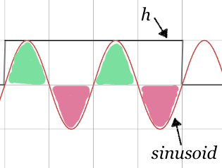

# Filters from a Dummy, Part 1

Some reflections on digital audio filters, because 1) I needed to implement filters as part of building a software synthesizer and 2) analogies to electric circuits or mechanical springs mean almost nothing to me.  Hopefully these will help provide some intuitions for you. In part one: feed-forward filters (aka finite impulse response filters, aka filtering by convolution) in which I'm awestruck by what a little addition and multiplication can get you!

## Background

By audio filter, I mean a transformation that amplifies or attenuates certain frequencies in an audio signal. You can think of this like the EQ control on your stereo amplifier or other playback device. When you adjust the treble or bass, you are applying a filter.

Filters are useful because we might want to filter out noise (that is, attenuate high frequencies) that was introduced in a live recording. Or remove low frequencies that sound unpleasant when played in a small room. And filters are critical in *subtractive audio synthesis* where different instruments are created by starting with a waveform that contains many frequencies (for example, a square wave) and then filtering out frequencies selectively.

As I'm writing audio processing *software*, I'm interested in *digital* audio filters: mathematical functions that transform audio samples to boost or reduce certain frequencies. At its simplest, a digital audio filter gets one input sample at a time (and some context) and generates a corresponding output sample.

> Caveat: I'm going to focus on filtering the samples — that is, in the *time* domain, not the *frequency* domain -- as I'm interested in doing filtering in real time. Don't worry! The frequency domain will appear soon enough.

There's one intuition that, like a sieve, a filter lets some things through while blocking others. At a high level, this is a good starting point, and maybe you can think of a sieve with small holes only letting high frequencies through, and one with big holes letting more frequencies though.

For me though, that doesn't help *that* much, since I'm implementing a filter that operates at the level of individual samples: what does it mean to let through "part" of a sample? Any given sample contains information for *all* different frequencies, so how does a filter tease that information apart?

I'm going to focus on low-pass filters, those that let low frequencies *pass through* unchanged and reduce the amplitude of higher frequencies. I find these filters relatively easy to think about. One important parameter of a low-pass filter is its "cut-off frequency" — the frequency below which signal is passed through and above which it is not. While an ideal low-pass filter can be described only in terms of this cutoff frequency, realistic filters don't behave quite so cleanly. For example, many low-pass filters also have a transition band — a range of frequencies where attenuation begins and then reaches its maximum.

## Feed-forward Filters

I wrote above that a filter is a function that takes each sample and some context and then generates a new sample. For feed-forward filters, this context is some of the previously seen input samples. In other words, input samples are fed *forward* in time and can affect both the current output sample and future output samples. Or put another way, an input sample can be *delayed* and act as an input for future output samples.

### Keep on Movin' (Average)

Let's start with a most naive of low-pass filters, the simple moving average filter. It's "simple" because it takes a fixed number of samples and weights them all equally. It's not a very *good* low-pass filter — for reasons we'll see below — but I find it intuitive and it will be a useful example to analyze.

Simple moving average describes a family of filters, each of which is defined by the number of samples that are averaged at each step. For feed-forward filters in general, the "order" of a feed-forward filter is the number of previous input samples that are used as part of computing the current output sample. Similarly, the "length" is the total number of input samples used, that is, one more than the order. A third-order (that is, length = 4) moving average filter looks like this:

$$
y[n] = \frac{x[n] + x[n-1] + x[n-2] + x[n-3]}{4}
$$

Where $x$ represents the input samples and $y$ is the output. This filter replaces every sample with the average of the last four samples, including the current one. As it advances to the next output sample, it moves the input window one step forward, so each input sample will contribute to four output samples.

#### Removing Noise

One use of a low-pass filter is to remove noise from a signal. If we take a pure tone and add noise to it (as you can hear in the first example below), we can use a 15th-order moving average filter to remove some of that noise (as you can hear in the second).
```tuun -C context.tuun
($220 + noise * 0.25) * 0.75 | fin(time - 5) | capture("01-moving-avg-noise-orig")
($220 + noise * 0.25) * 0.75 | fin(time - 5) | moving_average(15) | capture("02-moving-avg-noise-ma15")
```
By replacing each sample with the average of the last 16, the moving average filter *smooths* out the waveform: it reduces the amount of change from one sample to the next. What does it mean when there is a lot of "change from one sample to the next"? That occurs when there are higher frequencies present in the waveform, so smoothing means that higher frequencies are attenuated. In this case, this noise we've added is uniform across the range of frequencies (that is, it has energy at all frequencies) so a low-pass filter won't remove all of it, just the noise at higher frequencies.

#### Removing Clicks

A "click" is another type of distortion that you might like to remove from an audio signal. A moving average filter is not especially good at removing this sort of distortion, but it's useful to understand why. The waveform below is a pure tone combined with a 1 Hz click, both without and with the same moving average filter.
```tuun -C context.tuun
$220 + res($1, fixed([1,1,1])) | fin(time - 5) | capture("01-moving-avg-clicks-orig")
$220 + res($1, fixed([1,1,1])) | fin(time - 5) | moving_average(15) | capture("02-moving-avg-clicks-ma15")
```
One way to think about this case is that response of the filter is very "sharp" — samples move into the window and immediately carry the full weight of every other sample that's already in the window. Likewise, when they move out of the window, they immediately have no effect on the output at all. This means that a moving average filter is unable to remove short but abrupt distortions like these clicks: it can dull them a little bit, but they are still quite audible.

#### Removing a Pure Tone

Since we'd like to better understand how the moving average filter affects different frequencies, let's use waveforms comprised of only two pure tones — just two frequencies. The first waveform you can hear below is comprised of two component tones without a filter, while the second has the 15th-order moving average filter applied.
```tuun -C context.tuun
($220 + $2560) * 0.6 | fin(time - 5) | capture("01-moving-avg-2tones-orig")
($220 + $2560) * 0.6 | fin(time - 5) | moving_average(15) | capture("02-moving-avg-2tones-ma15")
```

While the higher frequency tone is still present in the second waveform, it has been significantly attenuated.

Moving average filters have some surprising (to me) behavior. This waveform uses the same filter and starts with the same two tones, but instead of staying constant, the frequency of the second tone is gradually increased over time.
```tuun -C context.tuun
($220 + $(linear(2560, 40))) * 0.6 | fin(time - 10) | moving_average(15) | capture("01-moving-avg-2tones-changing")
```
What happened here!? Ideally, a low-pass filter would attenuate more as the frequency got higher (or at least *not attenuate less*), but here the higher tone first gets softer and then louder. That is, the gain of the filter goes down **and then up** as the frequency increases. This is called a "ripple." We want to avoid ripples in low-pass filters in many situations, including (for example) in music, where melodies would be distorted as they pass across ripples.

Why does a moving average filter have ripples? Let's think about the shape of the original waveform. Remember that each tone is periodic and that for each negative value, an equal positive value appears half a wavelength later. If the number of elements in the moving average is equal to a multiple of the wavelength of the waveform (in terms of the number of samples), then when we take the average, these positive and negative elements will cancel each other out. A 15th-order moving average has 16 elements in it, and 1/16th of the sampling frequency (44100 Hz) is 2756 Hz, which is the frequency of the tone when it disappeared.

Two last notes on moving average filters. First, we don't have much control over the cutoff frequency: we can increase the order of the filter — this will lower the cutoff frequency — but it will also add ripples. Second, another challenge with moving average filters is that there's no way to control the width of the transition band.

### Analyzing Feed-forward Filters

We've heard how the moving average filter affects sounds, and we've got maybe a little intuition for how it works ( it removes higher frequencies by smoothing out the waveform). And we've also heard how it has some interesting responses to different frequencies: it's not just a matter of passing through the low frequencies (for some definition of "low") and attenuating the high ones.

To get a deeper understanding what's happening, let's do some math! I wrote the moving average filter above as you might expect an average to be written, but let's pull out the weights used in computing the average, which here are all equal. Here is the third order filter from above expressed as a sequence of weights:

$$
h = \left[ \frac{1}{4},\frac{1}{4},\frac{1}{4},\frac{1}{4} \right]
$$

Once we've done that, we can now write a generic equation for a feed-forward filter like this, where $K$ is the length of $h$:

$$
y[n] = \sum_0^{K-1} h[k] \cdot x[n - k]
$$

Remember we are assuming that $x$ is periodic, so we can just repeat the waveform to determine $x[n]$ for negative values of $n$.

There's a special notation for this sum-of-products, called a convolution:

$$
y[n] = (h * x)[n]
$$

Or more simply:

$$
y = h * x
$$

In addition to being concise, this notation make clear that we have three mathematical objects that we can operate on: the input, the output, and the filter definition itself.


<!--

... and spectrum

impulse response?


> Feed-forward filters are often called "finite impulse response" filters because, if the input samples eventually go to zero, then the output of the filter will also go to zero within a finite number of samples. The simplest case of an input that "goes to zero" is an impulse: a waveform where the first sample is `1` and all of the remaining samples are `0`.


-->


#### Frequency Response

Before we go further, grab a pencil and as you listen to the following waveform, plot the *loudness* of the tone as a function of time.
```tuun -C context.tuun
// maybe (really) shouldn't be linear
$(linear(100, 500)) | fin(time - 20) | moving_average(15) | capture("01-moving-avg-1tone-changing")
```
This tone starts at 100 Hz and goes up to about 10,000 Hz (from about the second G below middle C to to about the D# fives octaves above middle C). What you probably heard is a tone that starts loud and — as its frequency increases — gets softer, then oscillates between silent and soft. These are the ripples discussed above.

Since this graph shows how the filter responds to a range of frequencies — and you measured the gain or attenuation at each frequency — this plot is called the "frequency response" of the filter.And though you made the graph for just one frequency at a time, this graph can be used to understand how the filter will respond to any combination of frequencies.

#### The Convolution Revolution

Here are two things you need to buy into:

1.  The discrete Fourier transform (DFT) transforms periodic signals expressed as a function of time (that is, as a series of samples) into signals expressed as a combination of sinusoids at different frequencies, called a *spectrum*. That is, it breaks down a complex waveform into the contributions of a number of simple waveforms. These two representations are equivalent: either can be used to faithfully recreate the other.

2.  In addition to convolution in the time domain (for example, the weighted average above), feed-forward filters can be implemented by *element-wise product* in the frequency domain. That is, if we take the DFT of the signal and the DFT of the filter and multiply each pair of elements together, the result will be the DFT of the convolution of the original signal and filter. (If we want to convert the result back into the time domain, we can take the inverse DFT of the element-wise product.) This is called the "convolution theorem" and can be written like this:

    $$
    Y[m] = H[m] \cdot X[m]
    $$

    (Where $Y$, $H$, and $X$ are the DFTs of $y$, $h$, and $x$, respectively.)

Covering these properly is more than I can do in a short piece like this, so I highly recommend [Brian McFee's Digital Signals Theory](https://brianmcfee.net/dstbook-site/content/intro.html) which presents both of these in detail and with some wonderful interactive plots. It focuses on the discrete case, which is particularly helpful for me. I'm going do a short version that follows some of McFee's approach here.

Starting with the first claim: how does the DFT start with the waveform and find the right combination of sinusoids? Roughly, the DFT works by taking a set of pure sinusoids and computing how similar each sinusoid is to the original waveform. This similarity will indicate how much particular sinusoid contributes to the original waveform.

The similarity of two waveforms (which must be of equal length) is computed by taking the sum of the product of each pair of samples. For example, if two waveforms are both positive at a given time, those samples will contribute positively to the similarly; if one is positive and the other is negative, those samples will contribute negatively to the similarity. So the similarity between a waveform and itself will be very positive, and the similarity between a waveform and the null signal (all zeros) is zero. In the DFT, if the *magnitude* of the similarity between the original waveform and a particular sinusoid is large, then that sinusoid makes a large contribution to the waveform.

The second claim is a little more subtle, though you've already seen it in action yourself. When you listened to the moving average filter applied to rising tone and plotted its frequency response, you saw what would happen if the filter is applied independently to each component frequency.

As a simple example, if we take a waveform which is comprised of two components, say $x = x_1 + x_2$, then it's easy to show that we can apply the convolution to each component and then add the results. (This is just distributing multiplication over addition.)

<!-- linearity of DFT -->

$$
y[n] = (h * x)[n] =  \sum_0^{K-1} h[k] \cdot x[n - k] = \sum_0^{K-1} h[k] \cdot (x_1[n - k] + x_2[n - k])
$$

$$
  = \sum_0^{K-1} h[k] \cdot x_1[n - k] + \sum_0^{K-1} h[k] \cdot x_2[n - k] = (h * x_1)[n] + (h * x_2)[n]
$$

But that is not quite what the second claim is saying: the second claim says that we don't need convolution at all, and that if we take the DFT of the input *and* the filter, we can just do element-wise product!

 But what *is* the DFT of the filter? We haven't really considered what it means to treat the filter as a waveform, so what does it mean to take its Fourier transform? Let's just go through the math and see where that leads us.

We need $x$ and $h$ to have the same length, we first extend $h$ with zeros out to the length of $x$. Those zeros won't contribute to the DFT of $h$ since the similarity of all of those points will be zero for any of the sinusoids: we can just focus on the first $K$ samples of $h$ (where it's non-zero).

Next, we need to compute the similarity of $h$ with each of the pure sinusoids. Remember that all of values of $h[n]$ for $n \le k$ are positive (each equal to $1/K$) so we can focus on the sign and magnitude of the first $K$ values of a given sinusoid.[^1] Let's consider the similarity to $h$ with sinusoids in three broad groups:

* Sinusoids where the wavelength is greater than $2K$ samples. Since all the samples of the sinusoid will have the same sign for at least $K$ values, there will be a strong similarity between the sinusoid and $h$.

* Sinusoids where the wavelength is equal to $\frac{K}{m}$ samples for some positive integer value of $m$, or put another way, where $m$ wavelengths fit exactly into $K$ samples. Since each wavelength contributes equal positive and negative values, the similarity will be zero.

* Sinusoids with higher frequencies where the wavelength is less than $2K$ samples but not a multiple of $\frac{K}{m}$. In these cases, one ore more wavelengths will contribute equal positive and negative values, but one partial wavelength will not be canceled out.

These three cases can be pictured as in the examples below. Notice that the similarity of the first case is entirely positive, the second case has equal positive and negative parts, and the third case not-quite-equal positive and negative parts.


  
  

If we plot the magnitude of the similarity of a moving average filter to different sinusoids as a function of frequency of those sinusoids, we get something like the following:


On the left, we have frequencies $f < f_s/2K$ (where $f_s$ is the sampling rate) where there is high similarity; this is the first cast above. On the right, there are sharp drops at frequencies $f = f_s \cdot m / K$ (for positive integers $m$); this is the second case above. Finally, for other higher frequencies that are not a multiple of $f_s / K$ where the similarity is smaller than the first case, but not zero; this is the third case above.

This graph should look suspiciously like the graph you drew when listening to the moving average filter applied to the rising tone! (Go ahead and listen to it again.) This means we have our answer to the question "what is the DFT of a filter?" The DFT of a filter is its frequency response!!

If the DFT $X$ of a waveform $x$ represents the weight of each of the component sinusoids, and the DFT $H$ is the frequency response of the filter, then we can take each element of $X$ and multiply it by the corresponding element of $H$ to get the weight of the corresponding sinusoid in the output $Y$. This is exactly the second claim above: the DFT of the convolution of a filter is the same as the element-wise product of the DFT of the input and the DFT of the filter. We did it!


[^1]: I should say that I'm totally glossing over the *phase* of the component sinusoids, which the DFT has to account for. For our purposes here, just imagine that the sinusoids line up as best they can with $h$; for low frequencies, this means the peak of the wave coincides with the middle of $h$.


<!--  And secondly, the convolution theorem offers a potentially faster way of applying a filter, by converting the signal into the frequency domain, multiplying, and the applying the inverse discrete Fourier transform.) -->


### Sinc or Swim

<!--
windowed sinc filter
-->

This all points to a better way of designing a low pass filter. Rather than starting with the weights of the filter in the time domain, let's instead start in the *frequency* domain. Let's write down the frequency response we want, and then take the *inverse* DFT to arrive at the weights we should use in the time domain. (I found Chapter 16 "Windowed-Sinc Filters" of Steven W. Smith's <u>The Scientist and Engineer's Guide to Digital Signal Processing</u> to be a helpful reference for tis section.)

TODO finish this

<!--


as delay
-->


