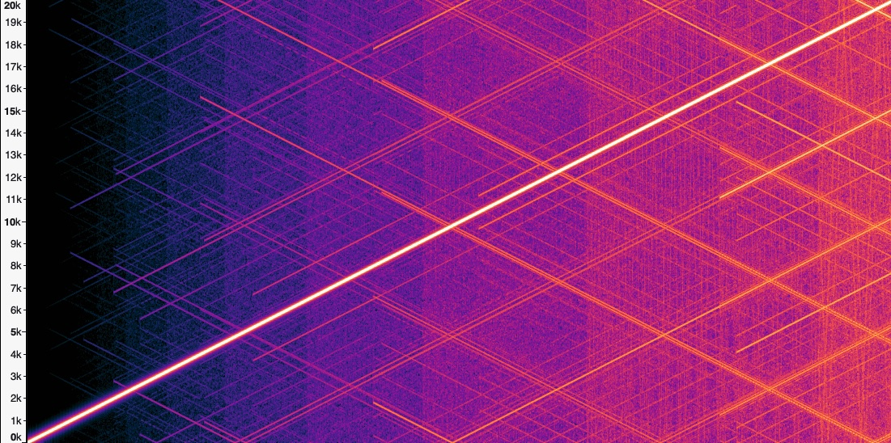
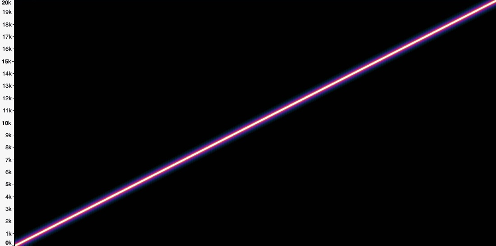
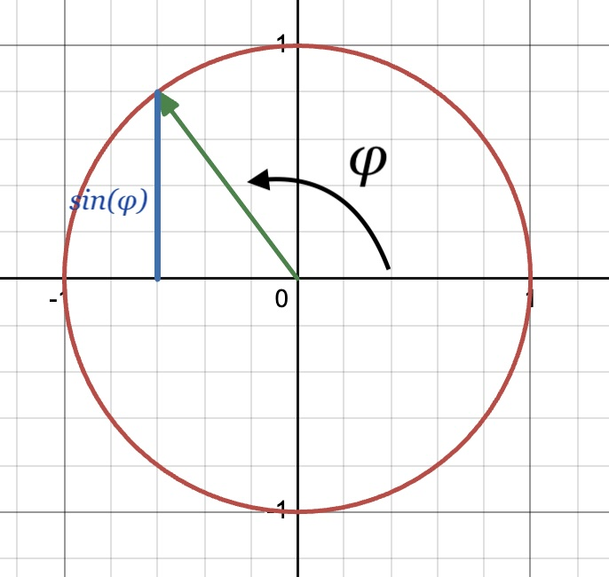
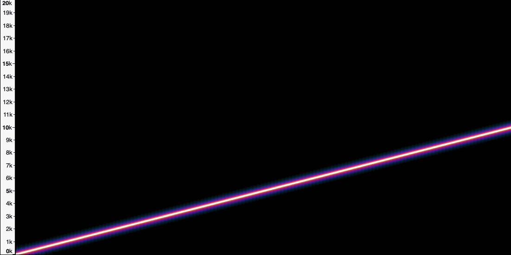
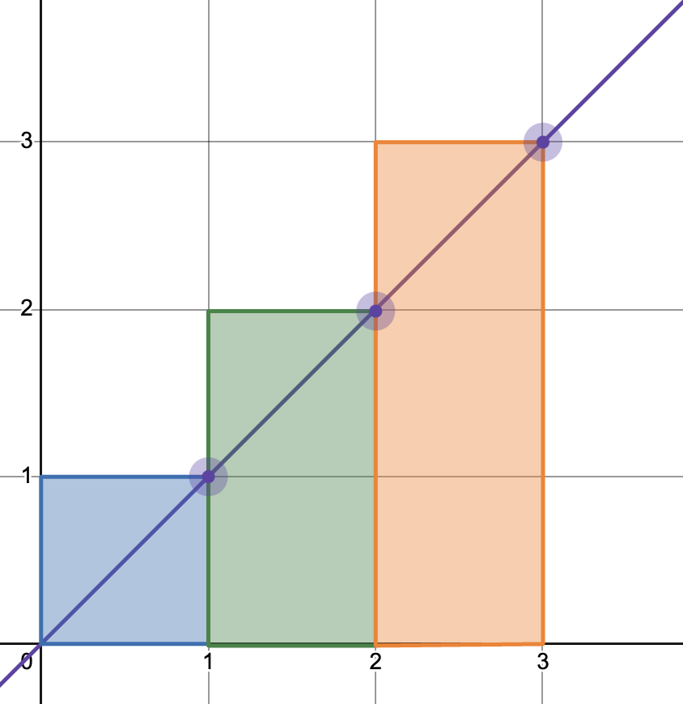
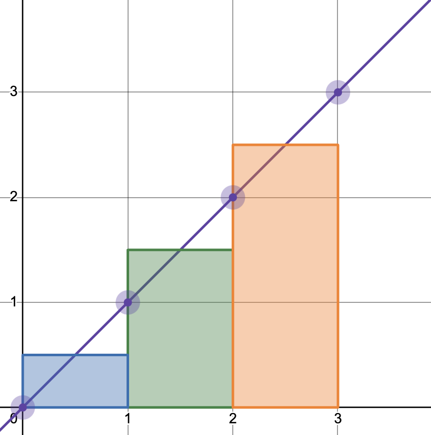

# Suddenly Instantaneous

In which I recount how I relearned (learned?) some trigonometry, some calculus, and a few things about floating point numbers. Knowledgeable readers: my deepest apologies.

In many cases, the frequency of a sound is constant or nearly constant: that is, the frequency does not change over time. In other cases, however, it does change, and when synthesizing sounds with non-constant frequency, you must carefully consider what the frequency is at each moment in time. We need to understand and compute the *instantaneous frequency*.

## Naively...

One foundational part of a software sound synthesizer is generating sine waves. (I'm writing a software synthesizer.) I learned in secondary school that a sine wave is determined by its frequency and initial phase. (I'm ignoring any constant phase offset, which is important when combining multiple waves, but not perceptible in a single wave and just confuses things here.) 

I learned that a wave $s$ with frequency $f$ (in hertz) can be written as function of time as follows:
$$
s(t) = \sin(2 \pi f  t) 
$$
Where $\sin$ is the ratio between length of the side of a right triangle opposite the given angle and the hypotenuse of that triangle. Right? Right.

While some types of synthesis use sine waves whose frequencies are constant (for example, additive synthesis), others require frequencies that change over time. Examples include implementing a vibrato effect or frequency modulation (FM) synthesis, or even just creating a frequency "sweep" (where the frequency of a single tone increases over time).

As an algebraically-minded person, I assumed (naively) that if the frequency itself varied as a function of time, that I could just substitute $f$ with its definition. For example, if the frequency started at 0 Hz and increased by 1 kHz every second, as in:
$$
f(t) = 1000t
$$
Then...
$$
s(t) = \sin(2 \pi  (1000t) t) = \sin(2000 \pi t^2)
$$
But listening to the waveform generated by this equation, I knew that some things (perhaps many things!) were wrong. Reader, listen:

- <audio controls>
  <source src="naively32.wav" type="audio/wav">
  Your browser does not support the audio element.
  </audio>

What are all of those sounds?! That's a lot more than a single sine wave! And yet the code was nothing more than the equation shown above. I was baffled by how such a simple piece of code could yield such a complex sound. 

Here's what the spectrum looks like as a function of time:

You can see the main tone as the bright diagonal line from the lower left to the upper right. The side tones are all of the other diagonal lines.

Those additional tones were not affected by changing any parameters of the synthesizer (for example, sampling rate, buffer size, output device). The sweep didn't cross the Nyquist frequency, so they weren't some sort of aliasing. On the other hand, their slopes *would* change with the slope of the frequency sweep, and they even occurred when the frequency was constant (though to a lesser extent).

My real clue was that these additional tones always got more numerous and more intense over time; that is, they seemed to be related to some sort of error that was compounding over time.

In my sound generation system, I'm treating the inputs and outputs of primitives like $\sin$ uniformly: I'm using the same type for both inputs and outputs. Since the audio library I was using only supported 32-bit floating point numbers, those were also the numbers used for all of the intermediate computation. After 10 seconds, the values passed to the $\sin$ function are greater than $10^6$ and so the precision is only about $10^{-1}$. Errors of that magnitude are remarkably audible!

When I changed the code to use 64-bit floating point numbers, this was the result:

- <audio controls>
  <source src="naively64.wav" type="audio/wav">
  Your browser does not support the audio element.
  </audio>

This output is *much* cleaner sounding, and its spectrum looks cleaner too.

But there was still one big problem: if $f(t) = 1000t$ why did the tone reach 20 kHz after 10 seconds instead of only 10 kHz? Why was the frequency increasing twice as fast as it should?

## Setting the Pace

To explain, let's take an example from a different domain. Instead of waves and frequency, let's take position and speed. Say that I have a friend who is a running a race, and I want to meet that friend part way through the race to offer them some water. I know that they plan to run at a speed of 10 miles per hour. That is, their speed is a constant. (In this, er, running example, I'm assuming that $t$ is measured in hours.)
$$
v(t) = 10 \text{ miles/hour}
$$
From this I can calculate where to meet them based on their position at a given time. In addition to some rudimentary trigonometry, I also learned in secondary school that speed is the derivative of position, and therefore position is given by the integral of speed.
$$
x(t) = \int_0^t v(\tau) \ d\tau \text{ miles}
$$
Which is, of course, just...
$$
x(t) = \int_0^t 10 \ d\tau  = 10 t - 0 t = 10t \text{ miles}
$$
That is, if I know how many hours have passed, I just multiply that by 10 to find my friend's location. It will surprise no one that my friend will have run 5 miles after half an hour. 

But what if my friend set their initial pace overconfidently? What if, after half an hour they need to slow down to half their initial speed? That is, their speed is now given as:
$$
v(t) =
\begin{cases}
  10 \text{ miles/hour} & \text{for   } 0 \le t < 0.5 \\ 
  5 \text{ miles/hour} & \text{for   } 0.5 \le t
\end{cases}
$$
And naively, you might try to calculate their position by integrating their speed in a piecewise manner:
$$
x(t) =
\begin{cases}
  10t \text{ miles} & \text{for   } 0 \le t < 0.5 \\ 
  5t \text{ miles} & \text{for   } 0.5 \le t
\end{cases}
$$
But of course even a quick inspection will reveal a problem at $t = 0.5$, where my friend, having run 5 miles in the first half hour, will suddenly (and disappointingly) find themselves transported back to the 2.5 mile mark. 

To properly calculate their position after the first half hour, we need to account for their faster pace during that first half hour. That is, we need to add in the $10 \text{ miles/hour} \cdot 0.5 \text{ hours} = 5 \text{ miles}$ that they ran during that first half hour, and then subtract that half hour when determining the contribution of their slower pace.
$$
x(t) =
\begin{cases}
  10t \text{ miles} & \text{for   } 0 \le t < 0.5 \\ 
  5 + 5 \cdot (t - 0.5) \text{ miles} & \text{for   } 0.5 \le t
\end{cases}
$$
Not to put too fine a point on it, but my friend's position at a given time depends not just on their speed a given moment, but on their speed at every moment in time up to that point!

## Acutely Angular

Remember that sound is a result of air particles moving back and forth, which cause your ear drums to move back and forth, which eventually stimulates nerves in your inner ear and creates the sensation of hearing. And even if a sound *wave* travels from you to me when you speak, individual air particles don't move that far: each one just goes back and forth a little bit. This *displacement* (written here as $s$) is important in sound synthesis, since it's the displacement of a speaker membrane creates those sound waves, and displacement is roughly what is being measured by individual samples.

Since we're interested here in generating *sine* waves, we know that displacement as a function of time can be written like this:
$$
s(t) = \sin(\phi(t))
$$

Where $\phi(t)$ is the angular displacement or *phase* at a given moment in time $t$ and is measured in radians. We're going to use phase as our analogue to the runner's position $x(t)$. I find it helpful to visualize phase as the angle of a unit vector rotating counterclockwise around the origin. $\phi$ increases with time, but since we are going to pass it to the $\sin$ function, we can also always take the value of $\phi \hspace{-0.3em} \mod 2 \pi$.

In this context, the sine of $\phi$ is the distance between the x-axis and the end of the unit vector. Or equivalently, it's the projection of that vector onto the y-axis or the "height" of the vector.

To meet our original goal then, we generate a series of phases, which we will then use to compute a series of displacements such that those displacements will approximate a sine wave with the desired frequency.

Note that the frequency of the sine wave — the rate at which the wave complete a cycle — is the same as the rate at which that vector completes one revolution. This *angular frequency* $\omega$ is the rate of change of $\phi$ measured in radians/second. (Angular frequency is just a constant times frequency measured in hertz.) That means that angular frequency $\omega$ is analogue of the runner's speed $v$. Just like we used the runner's speed to compute position, we're going to use angular frequency to compute the phase.

One thing that's nice about angular frequency is that, for constant angular frequency $\omega$, the change of phase $\phi$ for a given duration of time is always the same, regardless of what the initial value of $\phi$ is. This shouldn't be too surprising, given that "constant angular frequency" is just another way of saying that "phase varies at a constant rate." That is, if $\omega$ is constant, then we can pick $\Delta t$ such that there is some $C$ where the following holds for any value of $t$.
$$
\phi(t) - \phi(t + \Delta t) \text{ mod } 2\pi= C
$$

This is different from the behavior of $\sin(\phi(t))$, which even at constant frequency has no such equivalent notion of "constant change." For me, this simple behavior of phase with constant angular frequency makes it a good foundation for thinking about the phase of sine waves with more complex (and time-dependent) angular frequencies.

### An aside on perception

As my friend is running, it's easy for me to perceive *where* they are at any moment in time, but it's much more difficult to perceive how *fast* they are running in that instant. Of course, if I measure their position at *two* points in time, I can determine their average speed, or if I watch them run for a few seconds, I can tell if they are going fast or slow. But in general, for people and objects as big (and slow) as my friend, position seems to be the primary way I observe them, while speed takes second place.

While sound is fundamentally caused by the displacement of particles air and oscillating changes in air pressure, we don't perceive those displacements. Instead, the primary way that we perceive sound is its frequency. So while we might start with a runner's positions over time to determine their speed, if I want my synthesizer to work properly, I need to start with angular frequency to determine phase. 

## A Phased Approach

Just as we used the integral of speed $v$ to calculate the runner's position $x$, we can use the integral of angular frequency $\omega$ to calculate the phase $\phi$ (and eventually displacement $s$). That is, like position can be computed by adding up the infinitesimal changes over time (aka speed), phase can also be computed by adding up infinitesimal changes over time (aka angular frequency).
$$
\phi(t) = \int_0^t \omega(\tau) \ d\tau 
$$

I now know that:

 * (Angular) frequency is one of the the primary observable qualities of sound (as pitch)
 * (Angular) displacement can be computed by integrating the (angular) frequency

We can now properly compute the samples (that is, the displacements) for a frequency sweep determined by:
$$
f(t) = 1000t
$$
Or equivalently as angular frequency:
$$
\omega(t) = 2\pi \cdot f(t) = 2000\pi t
$$

If we assume that the initial phase is zero, we substitute and use the power rule:
$$
\phi(t) = \int_0^t \omega(\tau) \ d\tau = \int_0^t 2000\pi \tau \ d\tau = \frac{1}{2} 2000 \pi t^2 = 1000 \pi t^2
$$
Which is exactly a factor of two off from the definition I erroneously derived above. That's why my naive sweep ended at 20 kHz instead of 10 kHz! As when integrating the speed of my friend the running, it's important to understand the frequency at each point in time, the instantaneous frequency. If we assume that the frequency has been 10 kHz the entire time, then we'll compute the phase at the 20 second mark incorrectly (analogous to when we assumed that the runner had been running at 5 miles/hour the entire race). Just as when using velocity to compute position, we must consider the frequency at each point up to $t$ to compute the displacement at time $t$.

Incidentally, there's nothing wrong with equation for sine waves that I learned in secondary school, it's just that if the frequency is constant, then the integral is trivial:
$$
\phi(t) = \int_0^t 2\pi \cdot f \ d\tau =  2\pi \cdot f \cdot \int_0^t 1 \ d\tau = 2\pi \cdot f \cdot t
$$

## Routinely Rectangular

My synthesizer differs from this example in two ways:

 * It's based on samples: we only need to compute the phase at discrete moments in time.
 * We want to support frequencies that vary in arbitrary ways, including from input devices, and don't want to depend on an analytic solution to the integral.
<!-- Better to use indexed time like t_i instead of n? -->
Happily, these come together to support a simple and accurate implementation. Indexing with samples $n$ and using square brackets as in $\phi_\text{approx}[n]$ to represent discrete-time phase, we can approximate phase as:
$$
\phi_\text{approx}[n] = \sum_{k=0}^n \omega(k/f_s) \Delta t = \sum_{k=0}^n \frac{\omega(k/f_s)}{f_s}
$$
Where $f_s$ is the sampling rate and $\Delta t$ is the length of time represented by one sample and is equal to $1/f_s$. Sample $n$ represents an approximation of the phase at time $t = n/f_s$. Put another way, this equation says if we divide the change-in-phase per second by the number of samples per second, we get the change-in-phase per sample.

Since we care about each of the intermediate values, we can also think of this as the following recurrence:
$$
\phi_\text{approx}[0] = 0
\\[0.5em]
\phi_\text{approx}[n] = \phi_\text{approx}[n-1] + \frac{\omega(n/f_s)}{f_s} 
  \enspace \text{ (for $n$ = 1, 2, ...)}
$$

This is efficient (it requires only a few operations per iteration) and doesn't require a closed-form definition of frequency. Even using only 32-bit floating point numbers, we get a result that sounds and looks good:

- <audio controls>
  <source src="rectangle32.wav" type="audio/wav">
  Your browser does not support the audio element.
  </audio>

Part of the reason that this works well is that, because we're going to pass $\phi_\text{approx}[t]$ to the sine function, we can bound $\phi_\text{approx}[t]$ by taking the remainder after dividing it by $2\pi$ at each step:
$$
\phi_\text{approx}[n] = \left( \phi_\text{approx}[n-1] + \frac{\omega(n/f_s)}{f_s} \right) \hspace{-1em} \mod 2 \pi
$$
 And because $\omega(n/f_s)/f_s$ doesn't get large either, 32-bits is more than enough precision.

### Checking our work

Since we *can* integrate $\omega(t)$ analytically in the case of a sweep, we can check these discrete approximations by comparing $\phi_\text{approx}[t]$ against $\phi(t)$. I set up a simple test to check that the approximation is a reasonable match for the exact value. (Here, we still have $\omega(t) = 2000\pi t$, and I'm using $f_s = 100$.)

| $n$ | $t$	| $\omega(t)$ |	$\phi(t)$        | $\phi_\text{approx}[n]$ | $\epsilon_\phi = \phi_\text{approx}[n] - \phi(t)$ |
| -----: | ---: | ----------: | ---------------: | ---------------: | --------------: |
| 0      | 0.00 | 0.0         | 0.0000           | 0.0000           | 0.0000          |
| 1	     | 0.01	| 62.8	      | 0.3142	         | 0.6283	        | 0.3142          |
| 2	     | 0.02	| 125.7       | 1.2566	         | 1.8850	        | 0.6283          |
| 3	     | 0.03	| 188.5       | 2.8274	         | 3.7699	        | 0.9425          |
| 4	     | 0.04	| 251.3       | 5.0265	         | 6.2832	        | 1.2566          |
| 5	     | 0.05	| 314.2       | 7.8540	         | 9.4248	        | 1.5708          |
| 6	     | 0.06	| 377.0       | 11.3097	         | 13.1947	        | 1.8850          |
| 7	     | 0.07	| 439.8       | 15.3938	         | 17.5929	        | 2.1991          |
| 8	     | 0.08	| 502.7       | 20.1062	         | 22.6195	        | 2.5133          |
| 9	     | 0.09	| 565.5       | 25.4469	         | 28.2743	        | 2.8274          |

Whoa... maybe not as accurate as I'd hoped. What's going on here? Not only is there considerable error, it seems to be getting worse over time.

It's useful to consider the area-under-the-curve interpretation of the integral for a moment: taking the integral of $\omega$ is the equivalent of measuring the area beneath the line defined by $\omega$. With $\phi_\text{approx}$ we are approximating this by measuring the area of a series of rectangles: multiplying the value of $\omega(t)$ (the height) by $\Delta t$ (the width). Here's a simple example using the line $y = x$:

 
  

Notice how the shaded area consistently extends above the line: that is, the sum of the areas of the rectangles is always greater than the area under the line. This will continually overestimate the integral of $y = x$.

A slightly more sophisticated technique is to use *two* points on the line instead of just one to approximate the area. That is, we use the average of the current and previous points on the line. This is called a trapezoid approximation, since it calculates the area using a series of trapezoids. This works quite well for functions that are linear. Here's the equivalent picture:

 
  

This approximation works much better for linear functions like $y = x$ and $\omega(t) = 2000\pi t$. But why then does the sample above sound reasonable? Why don't we hear some distortion? There are two answers:

1. The error in associated with a rectangular approximation of a linear frequency sweep leads to only a constant change in the frequency.

2. The test I described and the table above use a ridiculously low sampling rate ($f_s = 100$).

Let's take each of these in turn.

#### Constantly constant

We took the integral of frequency to determine the phases over time (or rather, we approximated them) so we can reverse the process to understand what the true frequency of that series of phases should sound like. That is, we can take the derivative of the the approximation $\phi_\text{approx}[n]$ and compare that with the desired frequency $\omega(t)$ to learn how far "off" the approximation should sound.
<!-- 
Starting with the approximated phase $\phi_\text{approx}[n]$ as:
$$
\phi_\text{approx}[n] = \sum_{k=0}^n \frac{\omega(k/f_s)}{f_s}
$$
Then we plug in the definition of the frequency $\omega(t) = 2000\pi t$ to get:
$$
\phi_\text{approx}[n] = \sum_{k=0}^n \frac{2000\pi k/f_s}{f_s}
$$
And simplify:
$$
 = \frac{2000\pi}{f_s^2} \cdot \sum_{k=0}^n k = \frac{2000 \pi}{f_s^2} \cdot \frac{(n + 1) n}{2} = \frac{1000 \pi (n^2 + n)}{f_s^2}
$$
If we imagine for a moment that this phase is a smooth function, and recalling that at time $t$ we have $n = tf_s$, we can plug in to the get the following:
$$
\phi_\text{approx}(t) = \frac{1000 \pi (t^2f_s^2 + tf_s)}{f_s^2} = 1000 \pi t^2 + \frac{1000 \pi t}{f_s}
$$

(Yes, as I've written it, the approximated phase is not truly that smooth, but the digital-to-analog converter and other parts of the audio system will smooth it out.)

To get the actual frequency of the approximated waveform, we simply take the derivative!
$$
\omega_\text{approx}(t) = \frac{d \phi_\text{approx}(t)}{dt} = 2000 \pi t + \frac{1000\pi}{f_s}
$$
Comparing this to the desired $\omega(t)$ we can see that the error in angular frequency is just:
$$
\epsilon_\omega(t) = \frac{1000 \pi}{f_s}
$$
 -->
That is, the error in angular frequency is a constant! While the approximation of phase is getting farther and farther from the true phase, it's getting farther at a *constant* rate, which means that the frequency of the approximation is only shifted by a constant. My test was being too aggressive in assuming that the code would generate exactly the same linear sweep. It *was* generating a linear sweep, just a slightly different one.

In fact, it was generating a sweep that starts slightly higher and ends slightly higher than it should. How much higher? The example above uses a sampling rate $f_s$ of 44,100 Hz or 277,088 radians/second. This means at any given time, the frequency of that sample is only 0.0113 radians/second or 0.0018 Hz too high: far to small a difference to be perceived.

To get a sweep which started a whole 1 Hz higher, the sampling rate would need to be pushed down to 500 Hz, which corresponds to a very small part of the human audible range. So small that we can barely construct a sweep that fits within that range!

#### Rates are (damned) high enough

I spent some time looking for an example where the errors incurred by the rectangular approximation would be perceptible and especially an example where the error in frequency increased over time.

<!-- rectangle is more than fine for cases where the frequency varies slowly, and especially fine for cases where it varies periodically (since the errors it incurs in one part of the waveform are later cancelled out) -->

## Summary

Unlike many other aspects of the physical world, we perceive the derivative of a physical process rather than the process itself: we perceive the frequency of sound, rather than the displacement of air particles. To faithfully generate sounds with particular frequencies, we must calculate this displacement using the instantaneous frequency.

In cases were we can't or don't want to integrate frequency analytically, we can approximate it using 

While implementing a software synthesizer, I often came across this technique described as "direct digital synthesis." It seemed to be discussed either in the context of specialized hardware or further software optimizations (for example, using lookup tables to avoid computing $\sin$ for each iteration). Ultimately, however, if we want to synthesize a sine wave with a non-constant frequency — and we can't compute that integral analytically — we need to do *some* sort of approximation of that integral. That is, we need to compute a series of discrete sums.

<!-- explain DDS any why it's great 

not just as an optimization but basically necessary for cases where you don't want to / can't compute the integral analytically

  -->

