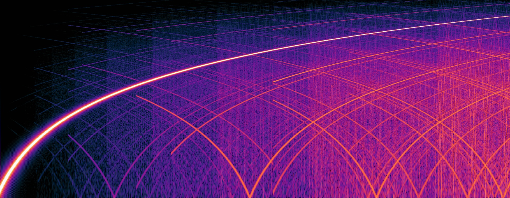

# Things I learned

A random assortment of ~~mistakes that I made~~ things that I learned while writing Tuun. Or at least ones that sound or look interesting.

## Accumulating Sidebands

I was using a frequency sweep to try to demonstrate the behavior of a low-pass filter when I heard some mysterious tones in a waveform like the one below. Ignoring the low-pass filter, it was supposed to be defined by the following waveform, which is a single sine wave whose frequency increases linearly.
```
Sin((Const(2 * PI * 250) ~. Time ~+ Const(2 * PI * 100)) ~. Time)
```
The initial playback I heard was something like this the following. (Sorry about the high pitches! You might not want to blast this around your dog. I applied a low-pass filter... but still.)

<audio controls>
  <source src="sweep-lpf-with-sidebands.wav" type="audio/wav">
  Your browser does not support the audio element.
</audio>

Some things I noted:
 * The sidebands occurred both in live playback and when recorded to a file.
 * The sweep never went past (or even got near) the Nyquist frequency (so it wasn't aliasing).
 * The sweep frequency was updated at every sample (not less frequently, like for each buffer block).
 * In fact, the sidebands didn't change with the buffer size (so not some other artifact of buffering).
 * The sidebands changed in character but didn't get better or worse when I changed the sampling frequency.
 * Some sidebands had the same slope as the main sweep but not all did, and sidebands swept up and down.
 * The sidebands also occurred even when only a single, constant frequency was played!!
 * The sidebands got worse over time – the longer the waveform, the worse they got!
 * The sidebands appeared in groups, and the time when a given group appeared seemed to be independent of everything else.

Here's what the spectra looked like:



Any guesses as to what I did wrong?

.

.

.

.

.

The real clue was that the sidebands got worse over time: that is, in addition to the shape of the waveform (for example, sweep or constant frequency), time was the only thing they depended on. 

`Time` is the only time-dependent primitive so that seemed like the place to look. `Time` the basis for waveforms that vary linearly (like the sweep) and is also used as an argument to other combinators like `Sin`. In the first case, it's fine for `Time` to get large, but when it appears as an argument to `Sin` like in a waveform like the one below, a large value of `Time` is bad.
```
Sin(Const(2 * PI) ~. Time)
```
What you heard above is the error associated with single-precision floating point numbers as they get farther from zero. In an ideal world, `Sin(Const(PI / 2))` is the same as `Sin(Const(101 * PI / 2))`, but of course there's nothing ideal about floating point numbers. _Ideally_, the argument to `Sin` will always be between zero and 2π, since that won't change the value of `Sin` and it will offer the highest accuracy.


<!-- 
## The Frequency of a Manually Controlled Frequency Sweep
-->

